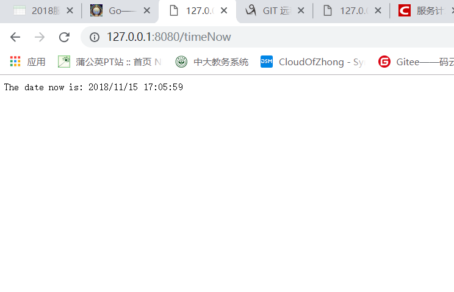

# CloudGo-io

### 概述

设计一个 web 小应用，展示静态文件服务、js 请求支持、模板输出、表单处理、Filter 中间件设计等方面的能力。（不需要数据库支持）

### 任务要求

编程 web 应用程序 `cloudgo-io`

---

#### 基本要求实现

- 运行go run main.go，访问`127.0.0.1:8080`主页


    - 这里我们使用`template.ParseFiles()`来实现模板的渲染和输出
        ```go
            t := template.Must(template.ParseFiles("templates/index.html"))
        ```

- 支持静态文件服务
    
    
    - 打开css文件

        
        

    - 打开images目录下的图片

        
        

    - 打开js目录下timeNow.js

        
        

- 支持简单 js 访问，输入`http://127.0.0.1:8080/timeNow`访问js，显示当前时间

    

    ```go
    mx.HandleFunc("/timeNow", showTime(formatter)).Methods("GET")
    ```
    `对url为"/timeNow"的请求进行处理，具体实现是下面定义的showTime函数`，主要实现是获得并显示出当前请求的具体时间。
    ```go
    func showTime(formatter *render.Render) http.HandlerFunc {
        return func(w http.ResponseWriter, req *http.Request) {
            formatter.Text(w, http.StatusOK,"The date now is: " +  time.Now().Format("2006/01/02 15:04:05"))
        }
    }
    ```

- 提交表单，并输出一个表格

    
    

- 对 /unknown 给出开发中的提示，返回码 501

    

- 客户端返回数据

    

---


